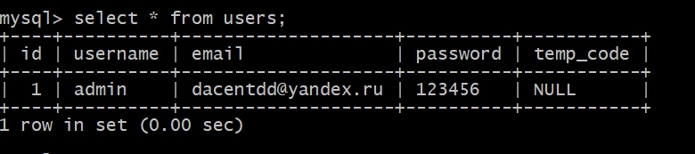
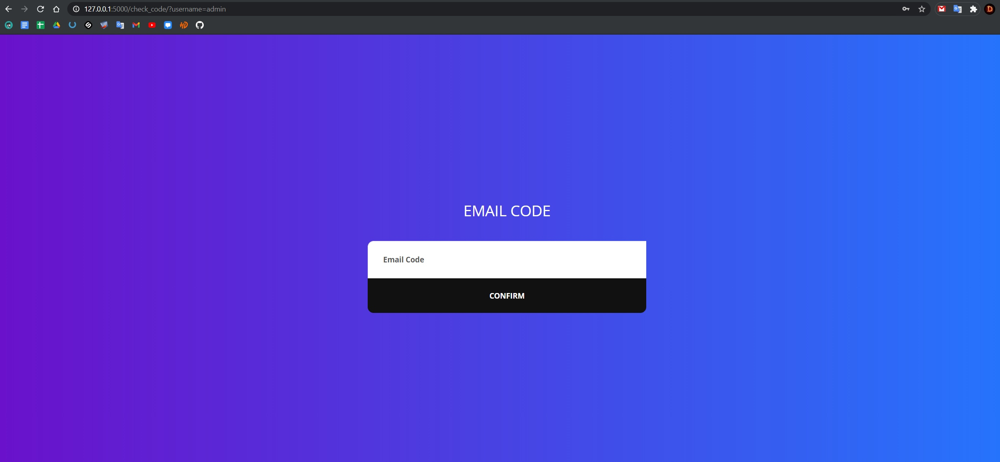
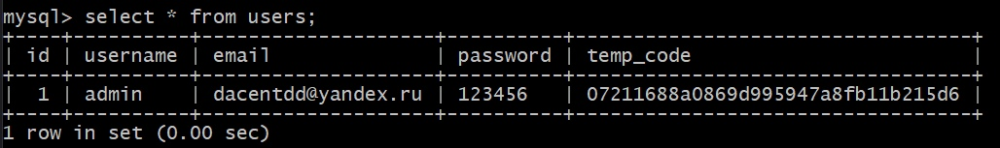
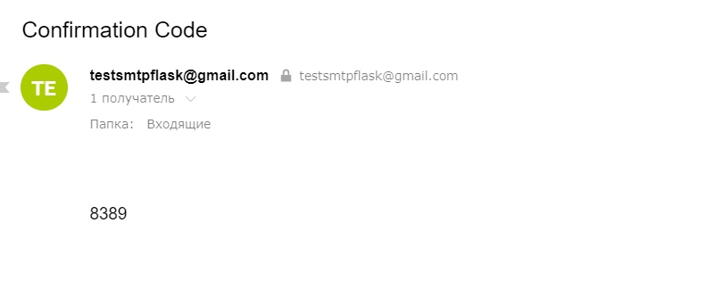
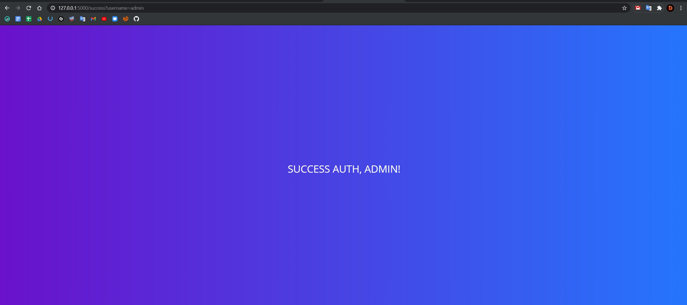

# Парольная аутентификация с подтверждением по email

Лабораторная работа №2 по предмету Разработка систем аутентификации и криптографии.

Вариант №5.

Реализовать аутентификацию по паролю с подтверждением по email. В таблице идентификаторов должны храниться: логин, email, пароль, хеш временного кода подтверждения (MD5). Таблица идентификаторов должна представлять собой таблицу в реляционной БД, данные должны передаваться через SQL-запросы. При аутентификации на сервере сравниваются пароли и на email пользователя отправляется сгенерированный на сервере временный код подтверждения. На клиенте после отправки данных с паролем должен произойти редирект на форму для ввода временного кода подтверждения. После отправки кода на сервере сравниваются хеш пришедшего кода и хеш кода из БД (MD5). При совпадении хешей аутентификация считается успешной и происходит редирект на страницу-заглушку.  
Переменные БД и пароль от email для SMTP скрыты. Без них работать не будет.

Написано на Python 3.9 + Flask 1.1.2
В качестве БД использовалась MySQL.

Алгоритм работы:

1) Ввести логин и пароль пользователя.

2) В случае успешной аутентификации вас перебросит на страницу, где можно ввести временный код подтверждения.

3) Если код подтверждения верный, вас перенаправит на страницу с надписью "Успешная аутентификация".

Пароль  хранится в нехэшированном виде, а код подтверждения хранится в виде md5 хэша и удаляется после использования.

Для запуска установить значения SQLALCHEMY_DATABASE_URI и MAIL_PASSWORD на свои, где:

SQLALCHEMY_DATABASE_URI = 'тип_БД+драйвер_БД://логинБД:парольБД@localhost/названиеБД'
MAIL_PASSWORD = пароль от почты GMAIL для SMTP. 
MAIL_USERNAME и MAIL_DEFAULT_SENDER заменить на вашу почту GMAIL.

Для запуска установить зависимости

`pip install -r requirements.txt`

и запустить сервер

`python app.py`

Таблица в БД MySQL с зарегистрированным пользователем admin:

Главная страница:

Страница для ввода кода подтверждения из email:

Таблица в базе данных с новым, захэшированным значением кода подтверждения:

Отправленный email с кодом подтверждения:

Страница, свидетельсвующая об успешной авторизации:
