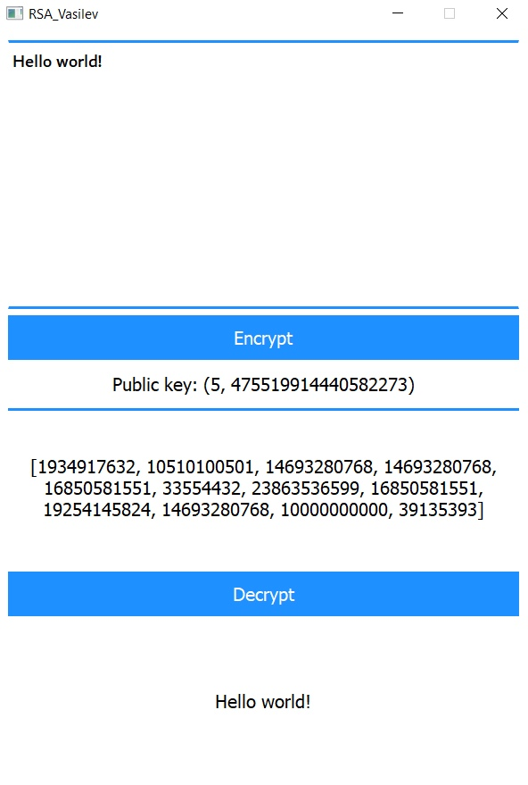
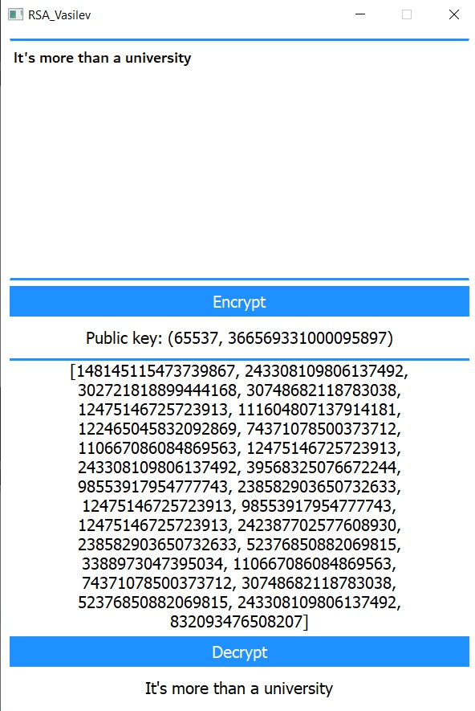

# Алгоритм RSA

Лабораторная работа №1 по предмету Разработка систем аутентификации и криптографии.

Вариант RSA.

Реализовать алгоритм шифрования RSA и подписать его сертификатом.

Написано на Python 3.9 + PyQT 5.13.
Для подписи приложения использовалась утилита PKI Client.

Алгоритм:

	1) Выбор двух больших неодинаковых простых чисел p и q.
	2) Находится их произведение n = p*q, которое называется модулем.
	3) Вычисляется функция Эйлера от числа n. Ф(n) = (p-1)(q-1)
	4) Находится открытая экспонента e, которая является взаимно простой с Ф(n). Обычно используются числа Ферма.
	5) Находится секретная экспонента d, которая мультипликативно обратная к e по модулю Ф(n).
	6) Далее пара {e, n} используется в качестве открытого ключа, а пара {d, n} в качестве закрытого ключа.
	7) Для зашифровки используется выражение C=m^e mod(n) , где m – сообщение.
	8) Для расшифровки m=C^d mod(n)

